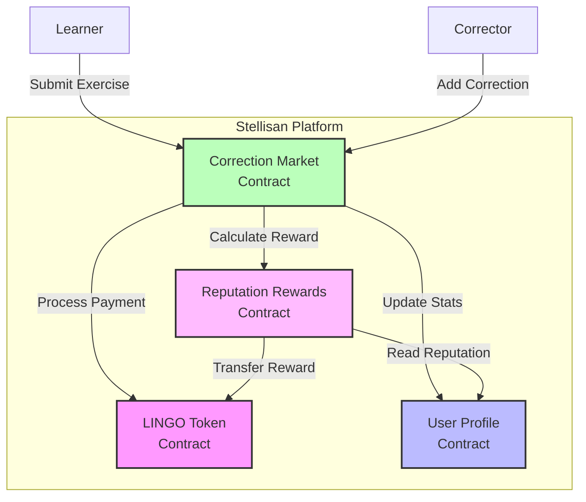
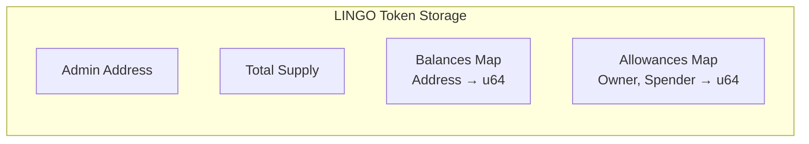
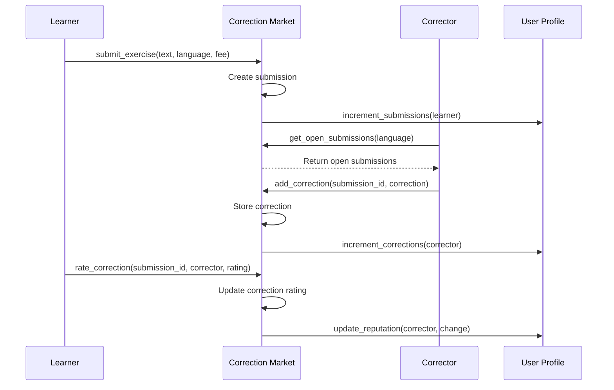
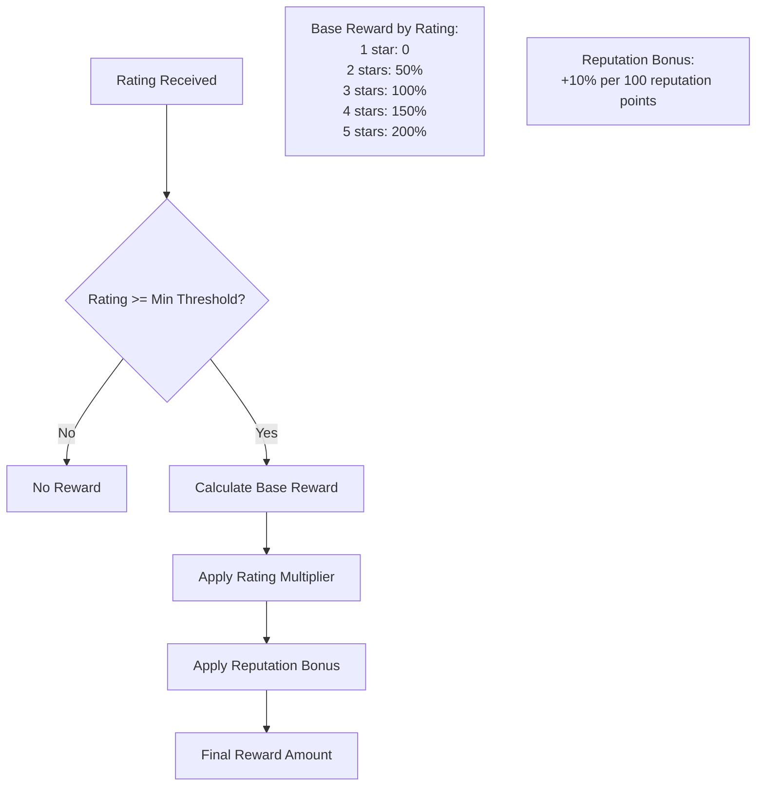
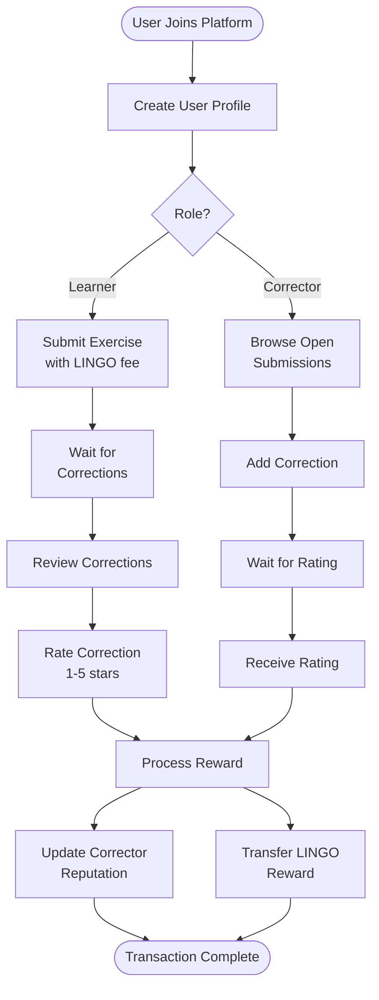
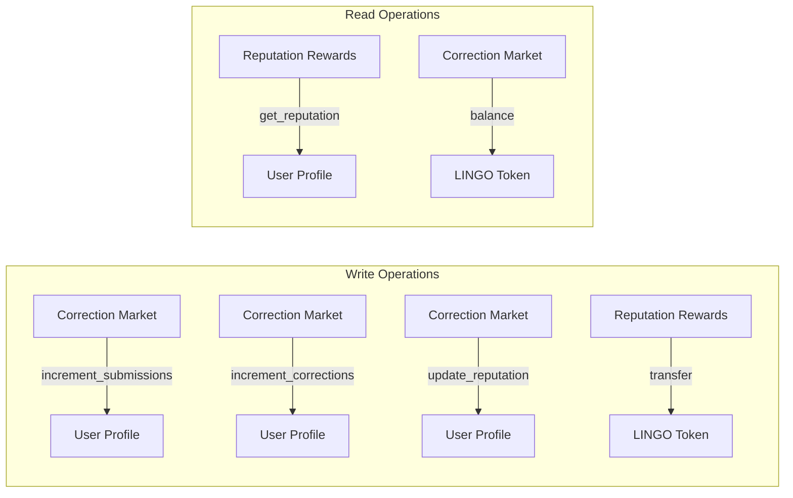
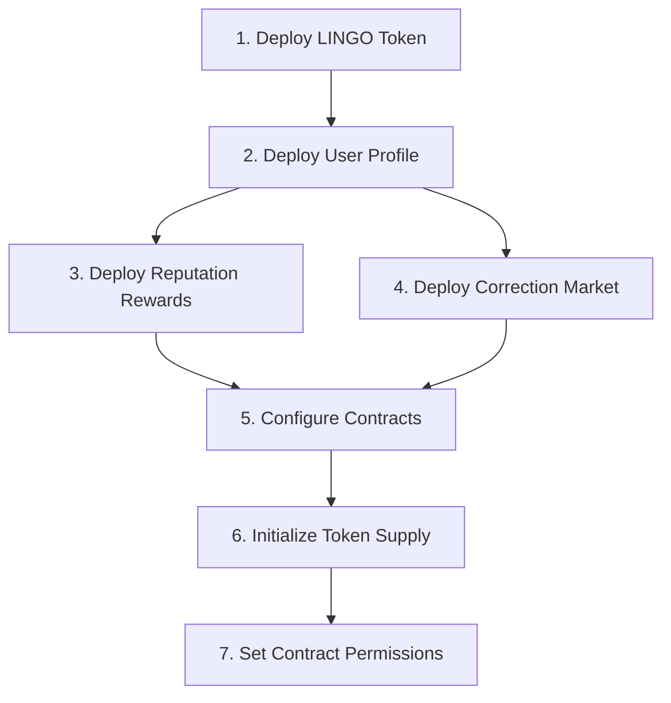

# Stellisan Smart Contracts Documentation

## Table of Contents
1. [Overview](#overview)
2. [Architecture](#architecture)
3. [Contract Details](#contract-details)
   - [LINGO Token Contract](#lingo-token-contract)
   - [User Profile Contract](#user-profile-contract)
   - [Correction Market Contract](#correction-market-contract)
   - [Reputation Rewards Contract](#reputation-rewards-contract)
4. [Contract Interactions](#contract-interactions)
5. [Deployment Guide](#deployment-guide)
6. [Security Considerations](#security-considerations)

## Overview

Stellisan is a decentralized language learning platform built on the Stellar blockchain using Soroban smart contracts. The platform enables learners to submit exercises for correction by native speakers, who are rewarded with LINGO tokens based on the quality of their corrections.

### Key Features
- **Decentralized marketplace** for language corrections
- **Reputation-based rewards** system
- **Native LINGO token** for payments and rewards
- **Quality assurance** through ratings and reputation

## Architecture

The platform consists of four interconnected smart contracts:



## Contract Details

### LINGO Token Contract

**Purpose**: Native token for the Stellisan platform, used for payments and rewards.

**Contract Address**: `lingo_token.wasm` (4.3 KB)

#### Key Functions

| Function | Description | Access |
|----------|-------------|---------|
| `initialize(admin, initial_supply)` | Initialize token with admin and supply | Admin only |
| `transfer(from, to, amount)` | Transfer tokens between accounts | Token holder |
| `approve(owner, spender, amount)` | Approve spending allowance | Token holder |
| `transfer_from(spender, from, to, amount)` | Transfer using allowance | Approved spender |
| `mint(admin, to, amount)` | Mint new tokens | Admin only |
| `burn(from, amount)` | Burn tokens | Token holder |

#### Storage Structure



### User Profile Contract

**Purpose**: Manages user profiles, reputation scores, and language preferences.

**Contract Address**: `user_profile.wasm` (4.3 KB)

#### Key Functions

| Function | Description | Access |
|----------|-------------|---------|
| `create_profile(user, languages)` | Create new user profile | User |
| `get_profile(user)` | Retrieve user profile | Public |
| `update_reputation(user, change, caller)` | Update reputation score | Authorized contracts |
| `increment_corrections(user, caller)` | Increment correction count | Authorized contracts |
| `increment_submissions(user, caller)` | Increment submission count | Authorized contracts |

#### Data Structures

```rust
struct UserProfile {
    reputation_score: u64,      // Starting at 100
    total_corrections: u32,     // Number of corrections made
    total_submissions: u32,     // Number of exercises submitted
    last_activity: u64,         // Timestamp of last activity
    languages: Vec<String>,     // Languages user knows
    is_verified: bool,          // Verification status
}
```

### Correction Market Contract

**Purpose**: Core marketplace for submitting exercises and receiving corrections.

**Contract Address**: `correction_market.wasm` (7.6 KB)

#### Key Functions

| Function | Description | Access |
|----------|-------------|---------|
| `submit_exercise(learner, text, language, fee)` | Submit exercise for correction | Learner |
| `add_correction(corrector, submission_id, text)` | Add correction to submission | Corrector |
| `rate_correction(learner, submission_id, corrector, rating)` | Rate a correction (1-5 stars) | Learner |
| `get_open_submissions(language, limit)` | Get open submissions by language | Public |
| `get_submission(submission_id)` | Get submission with corrections | Public |

#### Workflow Diagram



#### Data Structures

```rust
struct Submission {
    id: u64,
    learner: Address,
    exercise_text: String,
    exercise_hash: BytesN<32>,
    fee_amount: u64,
    status: SubmissionStatus,
    created_at: u64,
    language: String,
}

struct Correction {
    corrector: Address,
    correction_text: String,
    submitted_at: u64,
    rating: Option<u32>,  // 1-5 stars
}

enum SubmissionStatus {
    Open,
    HasCorrections,
    Completed,
    Expired,
}
```

### Reputation Rewards Contract

**Purpose**: Calculates and manages rewards for correctors based on ratings and reputation.

**Contract Address**: `reputation_rewards.wasm` (4.3 KB)

#### Key Functions

| Function | Description | Access |
|----------|-------------|---------|
| `initialize(admin)` | Initialize with default config | Admin |
| `process_reward(corrector, learner, rating, fee, caller)` | Process reward after rating | Authorized contracts |
| `calculate_reward(corrector, rating, base_fee)` | Calculate reward amount | Public |
| `update_config(admin, config)` | Update reward configuration | Admin |

#### Reward Calculation



#### Configuration

```rust
struct RewardConfig {
    base_reward: u64,              // Base reward amount
    reputation_multiplier: u64,    // Bonus per 100 reputation
    min_rating_for_reward: u32,    // Minimum rating (default: 2)
    reputation_bonus_per_star: u64,// Reputation gain per star
}
```

## Contract Interactions

### Complete User Journey



### Inter-Contract Communication



## Deployment Guide

### Prerequisites
1. Stellar account funded with XLM
2. Soroban CLI installed
3. WASM files built (✅ Already completed)

### Deployment Order



### Deployment Commands

```bash
# 1. Deploy LINGO Token
soroban contract deploy \
  --wasm target/wasm32-unknown-unknown/release/lingo_token.wasm \
  --source YOUR_ACCOUNT \
  --network testnet

# 2. Deploy User Profile
soroban contract deploy \
  --wasm target/wasm32-unknown-unknown/release/user_profile.wasm \
  --source YOUR_ACCOUNT \
  --network testnet

# 3. Deploy Reputation Rewards
soroban contract deploy \
  --wasm target/wasm32-unknown-unknown/release/reputation_rewards.wasm \
  --source YOUR_ACCOUNT \
  --network testnet

# 4. Deploy Correction Market
soroban contract deploy \
  --wasm target/wasm32-unknown-unknown/release/correction_market.wasm \
  --source YOUR_ACCOUNT \
  --network testnet
```

## Security Considerations

### Access Control
- **Admin Functions**: Protected by address verification
- **User Functions**: Protected by `require_auth()`
- **Contract-to-Contract**: Caller verification for sensitive operations

### Best Practices
1. **Input Validation**: All user inputs are validated
2. **Integer Overflow**: Using saturating arithmetic
3. **Reentrancy**: State changes before external calls
4. **Storage Optimization**: Using Symbol keys for efficiency

### Potential Improvements
1. **Time-based Expiry**: Add expiration for old submissions
2. **Slashing Mechanism**: Penalize low-quality corrections
3. **Delegation**: Allow users to delegate correction rights
4. **Batch Operations**: Process multiple corrections efficiently

## Testing Recommendations

### Unit Tests
Each contract includes comprehensive unit tests covering:
- Happy path scenarios
- Edge cases
- Error conditions
- Access control

### Integration Tests
Recommended test scenarios:
1. Complete user journey from submission to reward
2. Multiple correctors on single submission
3. Reputation calculation accuracy
4. Token transfer correctness

### Security Audit
Before mainnet deployment:
1. Professional security audit
2. Formal verification of critical functions
3. Stress testing with high volume
4. Economic attack vector analysis

## Conclusion

The Stellisan smart contracts provide a robust foundation for a decentralized language learning platform. The modular architecture allows for future enhancements while maintaining security and efficiency. The reputation-based reward system incentivizes quality corrections, creating a sustainable ecosystem for language learners and native speakers. 